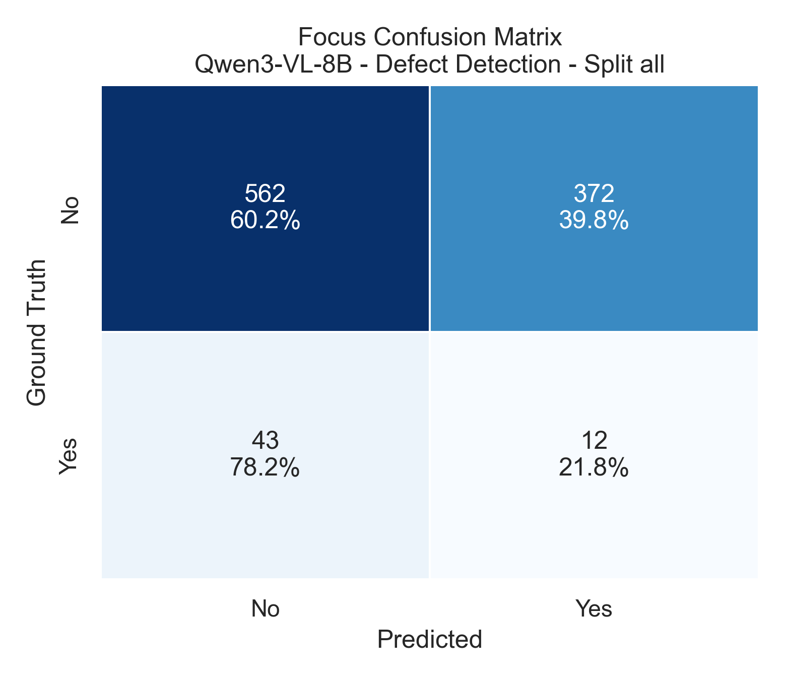

# Industrial Defect Detection

Open-source VLM benchmark for PCB automatic optical inspection reasoning across four defect types:

- 缺件 (Missing Component)
- 錫少 (Insufficient Solder)
- 站立 (Tombstoning)
- 翻件 (Flipped/Misoriented Component)


## Evaluation Details

- Models: Qwen3-VL-8B, LLaVA-1.5, LLaVA-1.6
- Tasks: Defect Detection, Component Type, Component Count, Mount Side, Pin Count

## Combined Results

| Model       | Overall Accuracy | Evaluated QA Pairs |
| ----------- | ---------------: | -----------------: |
| Qwen3-VL-8B |           38.26% |              4,815 |
| LLaVA-1.5   |           32.22% |             31,442 |
| LLaVA-1.6   |           24.36% |             31,442 |


## Example Focused Confusion Matrix

Single question + single model example:

- Model: Qwen3-VL-8B
- Question: Defect Detection
- Split: all



## Analysis

### Summary of Results

- Overall benchmark ranking: Qwen3-VL-8B (38.26%) > LLaVA-1.5 (32.22%) > LLaVA-1.6 (24.36%).
- Qwen3-VL-8B leads every split (03/05/07/09), with strongest performance on split 05 (44.89%).
- By task type, the easiest task for all models is Mount Side (~76% to 81%), while Component Count and fine-grained Component Type remain low.

### What The Full Experiment Shows

- The benchmark separates coarse spatial reasoning from fine semantic reasoning: models can often infer mount side, but struggle to reliably identify exact component semantics and counting details.
- Defect Detection is the most discriminative task between models: Qwen3-VL-8B reaches 58.11% while LLaVA-1.5 and LLaVA-1.6 are 9.36% and 5.59%, indicating a major architecture/representation gap for anomaly-sensitive decisions.
- The focused Qwen3-VL-8B confusion matrix (all splits) shows sensitivity to class imbalance: 574/989 correct (58.0%), 39.8% false-positive rate on normal samples (372/934), and 78.2% miss rate on defect samples (43/55). This means the model improves over LLaVA baselines but is not yet reliable enough for standalone production AOI gating.

## Additional Confusion Matrices

All-split confusion matrices are generated in [assets/results/confusion_matrices/defect_detection/all_splits](assets/results/confusion_matrices/defect_detection/all_splits):

- [assets/results/confusion_matrices/defect_detection/all_splits/confusion_matrix_defect_all_qwen3_vl_8b.png](assets/results/confusion_matrices/defect_detection/all_splits/confusion_matrix_defect_all_qwen3_vl_8b.png)
- [assets/results/confusion_matrices/defect_detection/all_splits/confusion_matrix_defect_all_llava_15.png](assets/results/confusion_matrices/defect_detection/all_splits/confusion_matrix_defect_all_llava_15.png)
- [assets/results/confusion_matrices/defect_detection/all_splits/confusion_matrix_defect_all_llava_16.png](assets/results/confusion_matrices/defect_detection/all_splits/confusion_matrix_defect_all_llava_16.png)

## Quick Reproduce

```bash
python -m venv .venv
source .venv/bin/activate
pip install -r requirements.txt

# Evaluate by split (entry scripts are under scripts/)
python scripts/eval03.py --json_path /path/to/Image_description_03.json --output_dir /path/to/out/03
python scripts/eval05.py --json_path /path/to/Image_description_05.json --output_dir /path/to/out/05
python scripts/eval07.py --json_path /path/to/Image_description_07.json --output_dir /path/to/out/07
python scripts/eval09.py --json_path /path/to/Image_description_09.json --output_dir /path/to/out/09

# Aggregate + focused confusion matrix for one model/question
python scripts/analyze_results.py \
  --source_root data/raw_experiments \
  --output_dir assets/results \
  --focus_model "Qwen3-VL-8B" \
  --focus_category "Defect Detection" \
  --focus_split all
```

## Data and Outputs

- Raw evaluation CSVs are kept in [data/raw_experiments](data/raw_experiments).
- Aggregated summaries are kept in [assets/results/summaries](assets/results/summaries).
- Charts are kept in [assets/results/charts](assets/results/charts).
- Confusion matrices are kept in [assets/results/confusion_matrices](assets/results/confusion_matrices).
- Focus error diagnostics are kept in [assets/results/diagnostics](assets/results/diagnostics).
