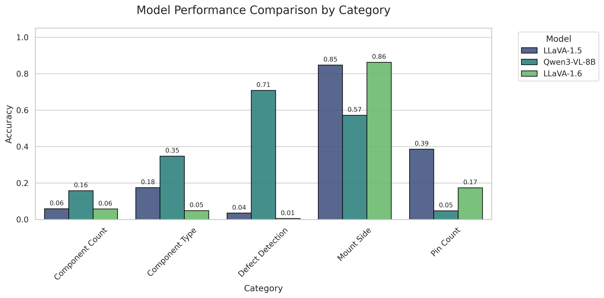
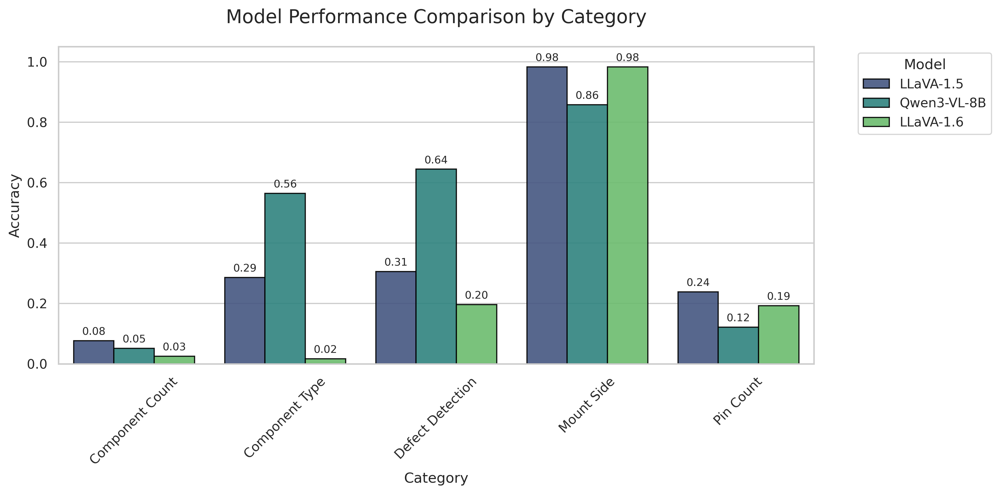
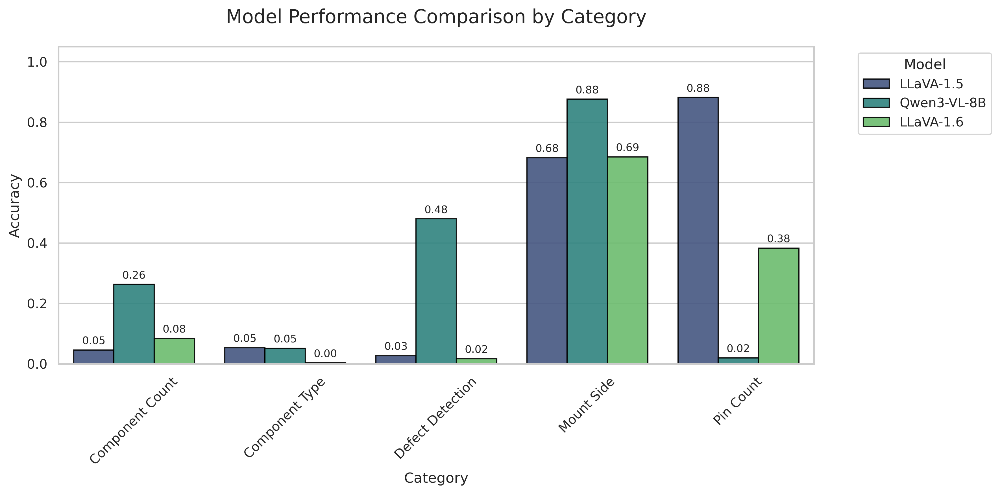
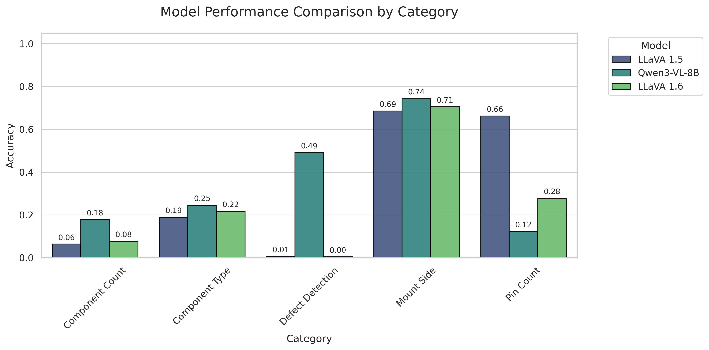
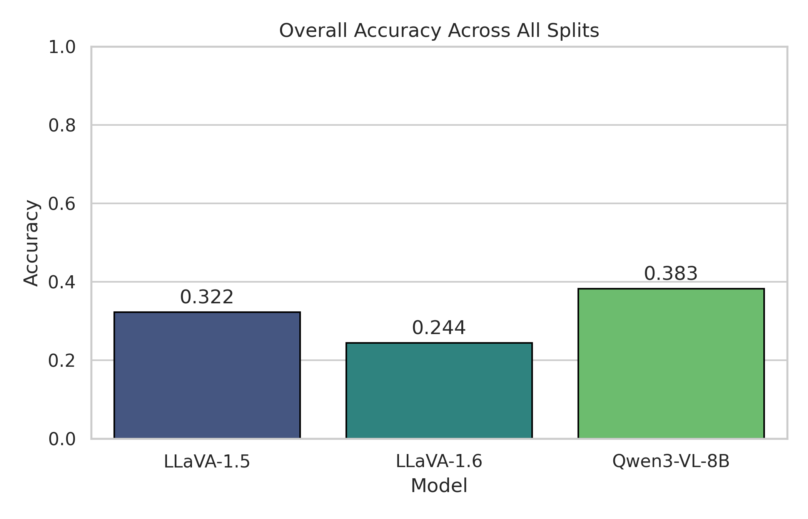

# Defect Detection Project (VLM Benchmark for PCB Inspection)

This repository presents a defect detection experiment for PCB component inspection using open-source vision-language models (VLMs).

The benchmark compares:
- LLaVA-1.5 (`llava-hf/llava-1.5-7b-hf`)
- LLaVA-1.6 (`llava-hf/llava-v1.6-mistral-7b-hf`)
- Qwen3-VL-8B (`Qwen/Qwen3-VL-8B-Instruct`)

The evaluation reformulates image understanding as structured QA tasks:
- Defect Detection
- Component Type
- Component Count
- Mount Side
- Pin Count

## Project Goal

The goal is to measure how well general-purpose VLMs can perform defect-related and structured component reasoning from PCB images.

This public repository intentionally excludes private dataset images and private annotation files. It includes:
- reproducible evaluation scripts
- setup instructions
- a safe example annotation entry
- benchmark comparison figures and summary metrics

## Repository Structure

- [eval03.py](eval03.py)
- [eval05.py](eval05.py)
- [eval07.py](eval07.py)
- [eval09.py](eval09.py)
- [scripts/eval_common.py](scripts/eval_common.py)
- [data/examples/image_description_example.json](data/examples/image_description_example.json)
- [assets/results](assets/results)

<!-- ## Environment Setup

Recommended Python version: `3.10`

```bash
python -m venv .venv
source .venv/bin/activate
pip install --upgrade pip
pip install -r requirements.txt
```

If you use a Hugging Face gated model, login first:

```bash
huggingface-cli login
```

## Annotation Format

Use the same schema as the example file:
- [data/examples/image_description_example.json](data/examples/image_description_example.json)

The evaluator expects keys such as:
- `Image Path`
- `Defect Descriptions`
- `Image Components descriptions`

## Running the Evaluation

You can run any split wrapper with your own private annotation JSON.

Example:

```bash
python eval03.py \
	--json_path /path/to/private/Image_description_03.json \
	--output_dir results/03 \
	--model_id "Qwen/Qwen3-VL-8B-Instruct"
```

Run multiple models in one command:

```bash
python eval09.py \
	--json_path /path/to/private/Image_description_09.json \
	--output_dir results/09 \
	--model_id "llava-hf/llava-1.5-7b-hf,llava-hf/llava-v1.6-mistral-7b-hf,Qwen/Qwen3-VL-8B-Instruct"
```

Notes:
- The scripts skip entries whose `Image Path` does not exist.
- Large images are resized to max side length 1024 for stable inference. -->

## Results: Final Merged Comparisons

Split 03:



Split 05:



Split 07:



Split 09:



Overall across all splits:



Summary CSVs used in analysis:
- [assets/results/summary_by_split.csv](assets/results/summary_by_split.csv)
- [assets/results/summary_overall.csv](assets/results/summary_overall.csv)
- [assets/results/summary_by_category_all_splits.csv](assets/results/summary_by_category_all_splits.csv)

## Quantitative Analysis

Overall accuracy by split:

| Split | LLaVA-1.5 | LLaVA-1.6 | Qwen3-VL-8B |
|---|---:|---:|---:|
| 03 | 0.3118 | 0.2400 | 0.3721 |
| 05 | 0.3797 | 0.2852 | 0.4489 |
| 07 | 0.3464 | 0.2405 | 0.3515 |
| 09 | 0.3244 | 0.2584 | 0.3590 |

Overall accuracy across all evaluated entries:

| Model | Accuracy | Evaluated QA Pairs |
|---|---:|---:|
| LLaVA-1.5 | 0.3222 | 31442 |
| LLaVA-1.6 | 0.2436 | 31442 |
| Qwen3-VL-8B | 0.3826 | 4815 |

Category-level average accuracy (across splits):

| Model | Defect Detection | Component Type | Component Count | Mount Side | Pin Count |
|---|---:|---:|---:|---:|---:|
| LLaVA-1.5 | 0.0936 | 0.1761 | 0.0616 | 0.7997 | 0.5422 |
| LLaVA-1.6 | 0.0559 | 0.0719 | 0.0613 | 0.8090 | 0.2571 |
| Qwen3-VL-8B | 0.5811 | 0.3022 | 0.1630 | 0.7624 | 0.0783 |

Interpretation:
- Qwen3-VL-8B achieves the best overall score in this benchmark.
- All models perform best on Mount Side, suggesting orientation reasoning is easier than defect semantics.
- Defect Detection is a major separator: Qwen3-VL-8B is much stronger than both LLaVA variants.
- Component Count remains hard for all models, indicating weak fine-grained counting reliability.
- Pin Count behavior differs strongly across models, likely due to extraction bias and prompt-format sensitivity.

## Privacy and Publication Notes

The following are intentionally excluded from this public repository:
- private raw images
- full private annotation JSON files
- private absolute file-system paths
- model cache directories and local logs
