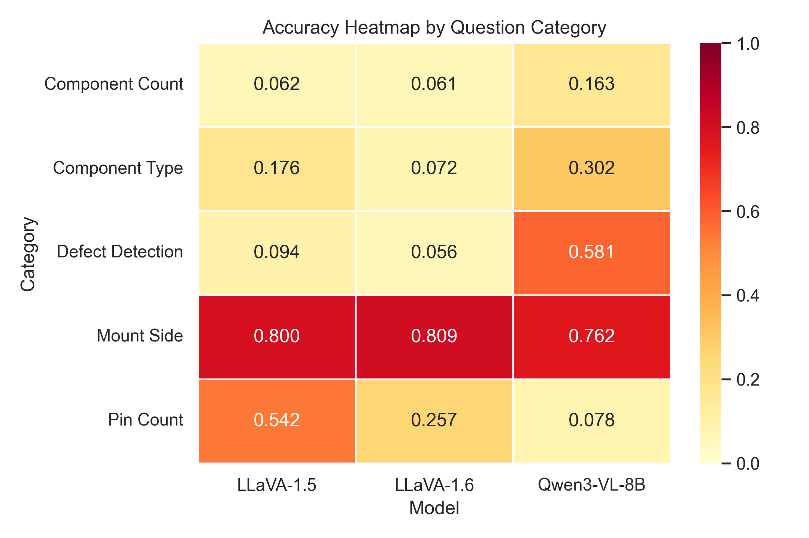

# Industrial Defect Detection

Open-source VLM benchmark for PCB automatic optical inspection reasoning across four defect types:

- 缺件 (Missing Component)
- 錫少 (Insufficient Solder)
- 站立 (Tombstoning)
- 翻件 (Flipped/Misoriented Component)


## Evaluation Details

- Models: Qwen3-VL-8B, LLaVA-1.5, LLaVA-1.6
- Tasks: Defect Detection, Component Type, Component Count, Mount Side, Pin Count

## Combined Results

| Model       | Overall Accuracy | Evaluated QA Pairs |
| ----------- | ---------------: | -----------------: |
| Qwen3-VL-8B |           38.26% |              4,815 |
| LLaVA-1.5   |           32.22% |             31,442 |
| LLaVA-1.6   |           24.36% |             31,442 |



## Example Focused Confusion Matrix

Single question + single model example:

- Model: Qwen3-VL-8B
- Question: Defect Detection
- On all splits


## Analysis

### Summary of Results

- **Overall ranking**: Qwen3-VL-8B (38.26%) > LLaVA-1.5 (32.22%) > LLaVA-1.6 (24.36%). Qwen leads every split (03/05/07/09), peaking at 44.89% on split 05, but no model is close to production-grade accuracy.

- **Task difficulty is highly uneven, and low scores are driven by answer bias rather than true reasoning.** Mount Side is easy for every model (~76–81%), while Component Count stays at 6–16% across the board. The sub-10% LLaVA scores on Defect Detection (LLaVA-1.5: 9.36%, LLaVA-1.6: 5.59%) are explained by the confusion matrices: LLaVA-1.6 predicts "Yes" on 100% of defect questions (6493/6493 negatives misclassified) and LLaVA-1.5 does so on 97.2% — the models are not inspecting the board, they are defaulting to a single label, so accuracy collapses to the minority-class rate. Qwen's 7.83% Pin Count shows the same pattern in the opposite direction: fine-grained counting is outside the model's calibrated output distribution.

- **Defect Detection is the only task that meaningfully separates architectures, but Qwen is still unreliable on the decision that matters.** Qwen reaches 58.11% vs. ~5–9% for both LLaVAs — a real representational gap for anomaly sensitivity. However, its focused confusion matrix (all splits, 574/989 correct) reveals a 39.8% false-positive rate on normal samples (372/934) and, more critically, a 78.2% miss rate on actual defects (43/55 missed). The aggregate number looks moderate only because normals dominate the test set; on the defect class itself the model fails more often than it succeeds, so it cannot be used as a standalone AOI gate.

## Additional Confusion Matrices

All-split confusion matrices are generated in [assets/results/confusion_matrices/defect_detection/all_splits](assets/results/confusion_matrices/defect_detection/all_splits):

- [assets/results/confusion_matrices/defect_detection/all_splits/confusion_matrix_defect_all_qwen3_vl_8b.png](assets/results/confusion_matrices/defect_detection/all_splits/confusion_matrix_defect_all_qwen3_vl_8b.png)
- [assets/results/confusion_matrices/defect_detection/all_splits/confusion_matrix_defect_all_llava_15.png](assets/results/confusion_matrices/defect_detection/all_splits/confusion_matrix_defect_all_llava_15.png)
- [assets/results/confusion_matrices/defect_detection/all_splits/confusion_matrix_defect_all_llava_16.png](assets/results/confusion_matrices/defect_detection/all_splits/confusion_matrix_defect_all_llava_16.png)

## Quick Reproduce

```bash
python -m venv .venv
source .venv/bin/activate
pip install -r requirements.txt

# Evaluate by split (entry scripts are under scripts/)
python scripts/eval03.py --json_path /path/to/Image_description_03.json --output_dir /path/to/out/03
python scripts/eval05.py --json_path /path/to/Image_description_05.json --output_dir /path/to/out/05
python scripts/eval07.py --json_path /path/to/Image_description_07.json --output_dir /path/to/out/07
python scripts/eval09.py --json_path /path/to/Image_description_09.json --output_dir /path/to/out/09

# Aggregate + focused confusion matrix for one model/question
python scripts/analyze_results.py \
  --source_root data/raw_experiments \
  --output_dir assets/results \
  --focus_model "Qwen3-VL-8B" \
  --focus_category "Defect Detection" \
  --focus_split all
```

## Data and Outputs

- Raw evaluation CSVs are kept in [data/raw_experiments](data/raw_experiments).
- Aggregated summaries are kept in [assets/results/summaries](assets/results/summaries).
- Charts are kept in [assets/results/charts](assets/results/charts).
- Confusion matrices are kept in [assets/results/confusion_matrices](assets/results/confusion_matrices).
- Focus error diagnostics are kept in [assets/results/diagnostics](assets/results/diagnostics).
