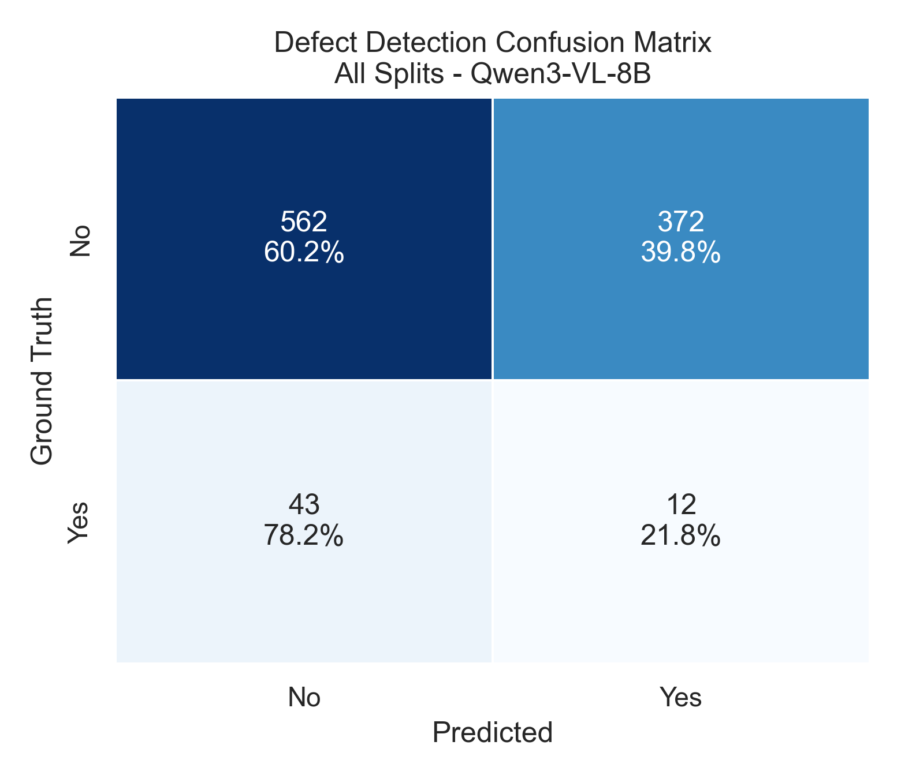

# Industrial Defect Detection

Open-source VLM benchmark for PCB AOI reasoning across four defect types:

- 03: 缺件 (Missing Component)
- 05: 錫少 (Insufficient Solder)
- 07: 站立 (Tombstoning)
- 09: 翻件 (Flipped/Misoriented Component)


## What I Evaluated

- Models: Qwen3-VL-8B, LLaVA-1.5, LLaVA-1.6
- Tasks: Defect Detection, Component Type, Component Count, Mount Side, Pin Count

## Headline Results

| Model       | Overall Accuracy | Evaluated QA Pairs |
| ----------- | ---------------: | -----------------: |
| Qwen3-VL-8B |           38.26% |              4,815 |
| LLaVA-1.5   |           32.22% |             31,442 |
| LLaVA-1.6   |           24.36% |             31,442 |

## Confusion Matrices (Defect Detection)

All-split confusion matrices are generated in [assets/results](assets/results):

- [assets/results/confusion_matrix_defect_all_qwen3_vl_8b.png](assets/results/confusion_matrix_defect_all_qwen3_vl_8b.png)
- [assets/results/confusion_matrix_defect_all_llava_15.png](assets/results/confusion_matrix_defect_all_llava_15.png)
- [assets/results/confusion_matrix_defect_all_llava_16.png](assets/results/confusion_matrix_defect_all_llava_16.png)



## Quick Reproduce

```bash
python -m venv .venv
source .venv/bin/activate
pip install -r requirements.txt
python scripts/analyze_results.py --source_root /path/to/eval_outputs --output_dir assets/results
```

## Key Takeaway

Qwen3-VL-8B is strongest overall and is the only model that shows meaningful discrimination on defect/no-defect, while both LLaVA baselines are heavily biased toward predicting defects.
